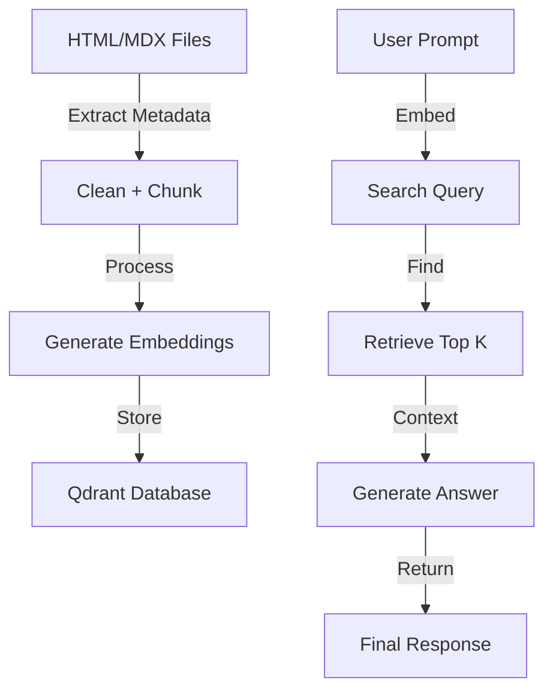

# 🧠 RAG System with Qdrant + Ollama (Mistral)

This project implements a modular Retrieval-Augmented Generation (RAG) pipeline.

---

## 🔧 Components

### `index_articles.py` — Indexing
- Cleans & chunks articles
- Generates embeddings
- Stores in Qdrant DB

### `query_rag.py` — Retrieval
- Embeds user query
- Searches Qdrant for relevant chunks
- Calls LLM with retrieved context

## 🧪 Run

### 1. Index articles

```bash
python index_articles.py
```

### 2. Ask a question

```bash
python query_rag.py
```

---

## 📦 Structure

```
rag_project/
├── docs/
├── index_articles.py
├── query_rag.py
├── utils.py
├── config.py
└── README.md
```

## 📊 Workflow Diagram



## 🔧 Configuration

The system supports multiple models through `config.py`:

- **llama3.2**: 3072-dimensional vectors
- **mistral**: 4096-dimensional vectors

To switch models, update `CURRENT_MODEL` in `config.py`.
